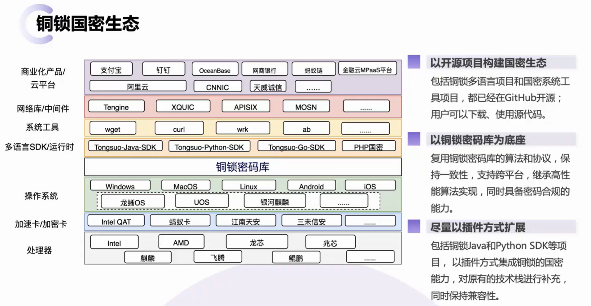

# Simple Secure Data Transmission System

——Comprehensive Practice of Applied Cryptography Course

这是一个未完成的项目，原因是铜锁的python JDK还未发布1.0.2版本。

课程实践要求文档里推荐了tongsuo，但是tongsuo的python JDK还没有开发完全，这次是踩了大坑了。最后还是用去年学长用gmssl完成的应付了一下。

但是这个项目给出了完整的项目结构，给出了每一步的实现思路。（只是卡在SM2加密没有办法调库）

期待有人将其完成，期待铜锁发布1.0.2版本。

>
>
>环境要求：
>
>python >= 3.6
>
>tongsuopy =1.0.2（截至2025/6/15 未发布）

# Q&A

- **铜锁（Tongsuo）和GmSSL的选择**：

  铜锁库（Tongsuo）是一个提供现代密码学算法和安全通信协议的开源基础密码库，铜锁库支持多种密码学算法，包括中国商用密码算法：SM2、SM3、SM4等，以及国际主流算法：ECDSA、RSA、AES、SHA等。此外，铜锁库还支持安全通信协议，如支持GB/T 38636-2020 TLCP标准，即双证书国密通信协议，支持RFC 8998，即TLS 1.3 + 国密单证书等。

  GmSSL是由北京大学自主开发的国产商用密码开源库，实现了对国密算法、标准和安全通信协议的全面功能覆盖。GmSSL 3在安全性和通信延迟上相对之前的TLS协议有巨大的提升，支持TLS 1.3协议和RFC 8998的国密套件。GmSSL 3默认支持密钥的加密保护，提升了密码算法的抗侧信道攻击能力。

  综合考虑，如果你希望在实践中获得更全面的密码学算法和安全通信协议的支持，铜锁库可能是一个更好的选择，因为它不仅支持国密算法，还支持国际主流算法，这将有助于你更全面地了解和掌握密码学知识。同时，铜锁库在**社区支持和开源项目活跃度方面**也表现良好，这可能有助于你在实践中遇到问题时获得更多的帮助和资源。此外，铜锁库还提供了丰富的API接口和多语言适配层，这将有助于你将密码学功能集成到应用程序中，并进行性能测试。

  主要还是考虑社区支持，有足够清晰的开发者文档查阅。

  另外，以前有学长使用gmssl库完成这项实践了，这次我们采用铜锁库。

- **完成实践项目使用的编程语言的选择**

  **开发效率高**：Python 语法简洁，代码量少，易于快速实现和调试。当前只有10天时间，备考8门必修课，还有各种实践项目，所以效率是第一位的。

- **GmSSL和Tongsuo的Python绑定**

  这里你会发现，这两种开源密码库的源代码都是C/C++编写的，但是我们要使用python学习和测试。

  通常它们提供了两种支持：独立的Python SDK，ctype支持的python调用

  以gmssl举例：

  1. **通过 pip 安装 `gmssl-python` 包**： 这种方法是通过 Python 的包管理工具 pip 来安装 GmSSL 的 Python 封装包。这种方式简化了安装过程，使得 Python 开发者可以直接通过 Python 代码调用 GmSSL 提供的密码学功能。这种方式适用于快速开发和测试，因为它不需要开发者关心底层的动态链接库的安装和配置。`gmssl-python` 会定期发布到 Python 代码仓库中，可以通过 pip 工具安装。

     ```cmd
     pip install gmssl
     ```

  2. **通过 ctypes 调用本地安装的 GmSSL 动态链接库**： 这种方式需要开发者首先在系统上安装 GmSSL 的动态链接库（如 `libgmssl.so` 或 `libgmssl.dll`），然后通过 Python 的 ctypes 库来调用这些本地库中的函数。这种方法提供了更底层的访问能力，允许开发者直接与 GmSSL 库交互，但同时也要求开发者对系统环境和库的安装有更深入的了解。这种方式适用于需要高度定制或优化性能的场景。GmSSL-Python 项目是 GmSSL 密码库的 Python 封装，它利用 `ctypes` 实现在 Python 中访问底层的 GmSSL 库。

  ```cmd
  git clone https://github.com/guanzhi/GmSSL.git
  cd GmSSL
  mkdir build
  cd build
  cmake clean
  cmake -f Makefile.android
  make
  sudo make install
  ```
  ```python
  from ctypes import cdll, c_char_p, c_int, c_ubyte, POINTER, Structure, byref
  # 加载 GmSSL 动态链接库
  libgmssl = cdll.LoadLibrary('/usr/local/lib/libgmssl.so')
  # 定义函数参数类型
libgmssl.sm3_hash.argtypes = (c_char_p, c_int)
  libgmssl.sm3_hash.restype = c_ubyte
  ```


  两种方法的主要区别在于安装和使用方式，以及对系统环境的依赖程度。通过 pip 安装的方式更简便，适合大多数开发场景；而通过 ctypes 调用的方式则提供了更高的灵活性和控制度，但需要更多的配置工作。

  
  **如果你需要快速开始开发并且不想处理底层的库配置，那么通过 pip 安装 `gmssl-python` 可能是更好的选择。如果你需要更细粒度的控制或者想要优化性能，那么通过 ctypes 调用本地库可能是更合适的选择。**
  
  在这学期第一个实践项目中，配置过一次openssl的C库安装调用，感受还是挺麻烦的，对计算机基础知识要求比较高。**因此，这个实践项目采用安装铜锁支持的python jdk来调用铜锁。**

# 相关资料

铜锁-python JDK：https://github.com/Tongsuo-Project/tongsuo-python-sdk?tab=readme-ov-file

铜锁官网：[https://www.tongsuo.net](https://www.tongsuo.net)

代码仓库：[https://github.com/Tongsuo-Project/Tongsuo](https://github.com/Tongsuo-Project/Tongsuo)

帮助文档：[https://www.yuque.com/tsdoc/ts](https://www.yuque.com/tsdoc/ts)



## 国密算法

国密即国家密码局认定的国产密码算法。主要有SM1，SM2，SM3，SM4。密钥长度和分组长度均为128位。

- SM1 为对称加密。其加密强度与AES相当。该算法不公开，调用该算法时，需要通过加密芯片的接口进行调用。

- **SM2为非对称加密，基于ECC。该算法已公开。由于该算法基于ECC，故其签名速度与秘钥生成速度都快于RSA。ECC 256位（SM2采用的就是ECC 256位的一种）安全强度比RSA 2048位高，但运算速度快于RSA。**

- SM3 消息摘要。可以用MD5作为对比理解。该算法已公开。校验结果为256位。

- **SM4 无线局域网标准的分组数据算法。对称加密，密钥长度和分组长度均为128位。（类似DES/AES）**

